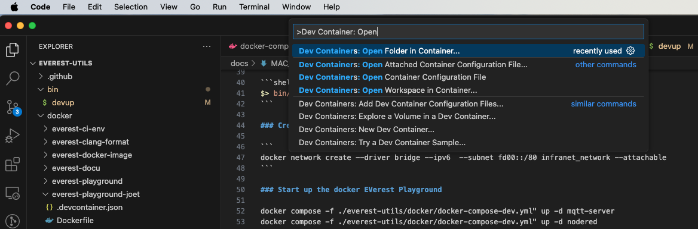
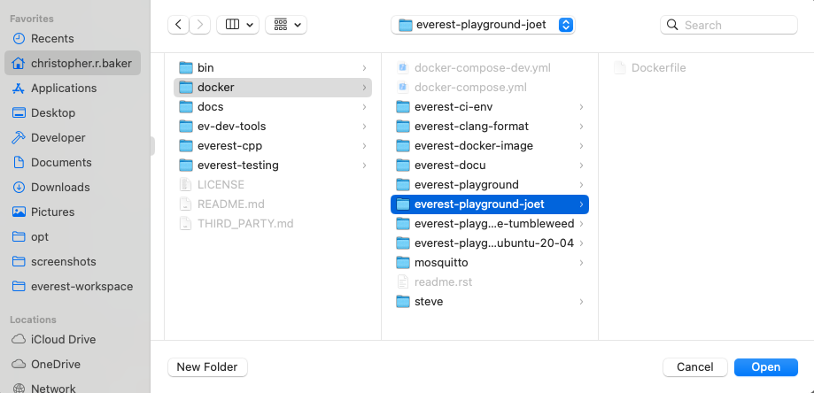

# Mac Development Setup

## Application Installs

* Install [Homebrew](https://brew.sh/) this will prompt for a bunch of passwords entries. It is working just get to the end!
* Install [Docker Desktop](https://docs.docker.com/desktop/install/mac-install/)
* Install [VSCode](https://formulae.brew.sh/cask/visual-studio-code)
    * Install [Dev Containers](https://marketplace.visualstudio.com/items?itemName=ms-vscode-remote.remote-containers) extension

## GitHub Setup

Create an ssh keypair:

```
ssh-keygen -t rsa -a 100 -Z aes128-gcm@openssh.com
```

Create a file `config` in the ~/.ssh folder:

```
touch ~/.ssh/config
```

Add the following to the file:

```
Host github.com
    AddKeysToAgent yes
    User git
    PubkeyAcceptedAlgorithms +ssh-rsa
```

## Standup Dev Playground

### TL;DR

This repo includes a script that does the setup steps below checking that your environment is setup correctly 
and if so running the commands to stand up the Docker network and dev playground.

```shell
$> bin/devup
```

### Create docker network

```
docker network create --driver bridge --ipv6  --subnet fd00::/80 infranet_network --attachable
```

### Start up the docker EVerest Playground

docker compose -f ./everest-utils/docker/docker-compose-dev.yml" up -d mqtt-server 
docker compose -f ./everest-utils/docker/docker-compose-dev.yml" up -d nodered

## Start VSCode Docker Dev Env

In VSCode:

* Press `CMD + Shift + P`
* type `Dev Containers: Open Folder in Container...`



* Navigate and open the docker/everest-playground-joet folder



This will open your VSCode environment inside the EVerest Playground:


You are now ready to go!

### Stopping things

Code > File > Close Remost Connection

## Resources

* [Node-RED](https://nodered.org/)

```
./dist/bin/manager --config ../config/config-sil-ocpp201.yaml
```
