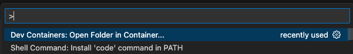
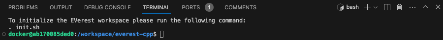
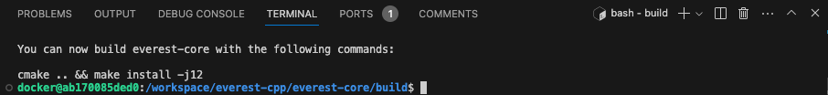
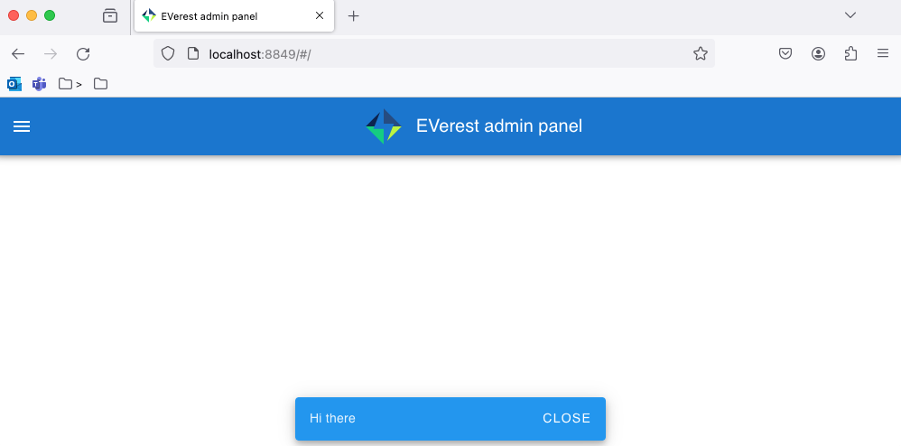

# Mac Development Setup

## Application Installs

* Install [Homebrew](https://brew.sh/) this will prompt for a bunch of passwords entries. It is working just get to the end!
* Install [Docker Desktop](https://docs.docker.com/desktop/install/mac-install/)
* Install [VSCode](https://formulae.brew.sh/cask/visual-studio-code)
    * Install [Dev Containers](https://marketplace.visualstudio.com/items?itemName=ms-vscode-remote.remote-containers) extension

## GitHub Setup

Create an ssh keypair:

```
ssh-keygen -t rsa -a 100 -Z aes128-gcm@openssh.com
```

Create a file `config` in the ~/.ssh folder:

```
touch ~/.ssh/config
```

Add the following to the file:

```
Host github.com
    AddKeysToAgent yes
    User git
    PubkeyAcceptedAlgorithms +ssh-rsa
```

## Standup Dev Playground

Run the `./bin/devup` shell in order to stand up the required Docker network and containers.

## Start VSCode Docker Dev Environment

In VSCode:

* Press `CMD + Shift + P`
* type `Dev Containers: Open Folder in Container...`



* Navigate and open the docker/everest-playground folder. 


This will open the EVerest Playground as a VSCode dev container. You should now be ready to go.

## Initialize 

Now we run commands inside the Playground based on the instructions from the [`everest-cpp`](/everest-cpp/README.md)
subdirectory.

Initialize the EVerest workspace sourcing the *[init.sh](./init.sh)* file:

```bash
. init.sh
```



The working directory will be changed to *everest-core/build*. Here you can use cmake and make to build the project:

```bash
cmake .. && make install
```

You can also use [make's -j flag](https://www.gnu.org/software/make/manual/html_node/Parallel.html) to speed up
the build:

```bash
cmake .. && make install -j12
```



### Starting everest with SIL simulation and a user interface

```bash
./dist/bin/manager --config ../config/config-sil-dc.yaml
```

This starts the EVerest Manager with the modules loaded determined by the `config-sil-dc.yaml` config file.

You can interact with it using the Node-RED UI by opening your browser to `http://localhost:8849/`.



## Stopping things

`Code > File > Close Remost Connection`

## Resources

* [Node-RED](https://nodered.org/)
